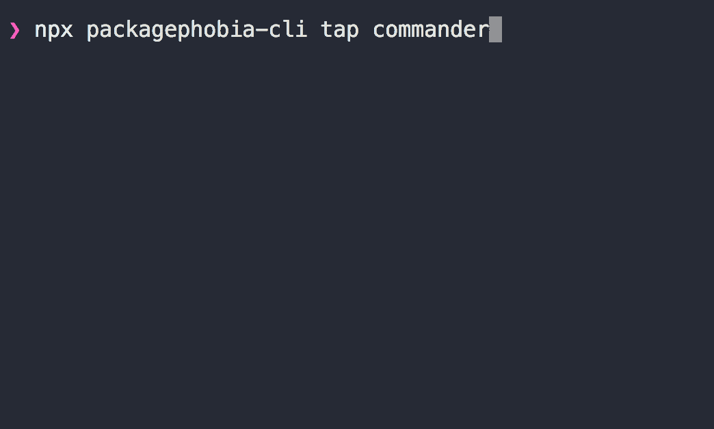

# packagephobia-cli [](https://travis-ci.org/chinanf-boy/packagephobia-cli) [](https://codecov.io/gh/chinanf-boy/packagephobia-cli?branch=master) [](https://packagephobia.now.sh/result?p=packagephobia-cli)

「 cli for packagephobia 」

## Install

```
npm i -g packagephobia-cli
```

> or

```
npx packagephobia-cli tap commander@2.15.0
```



## Usage

```
packagephobia-cli tap commander
```

```
✔ tap@12.0.1
Publish Size:108kB
Install Size:21.1MB
✔ commander@2.17.1
Publish Size:60.7kB
Install Size:60.7kB
```

## cli

```
  Usage: cli <name> [options]

  show pkg size

  Options:

    -v, --version        output the version number
    -D, --debug [debug]  debug: boolean/string  (default: false)
    -m, --markdown       show the markdown link
    -h, --help           output usage information
```

## concat

- [two-log-min](https://github.com/chinanf-boy/two-log) just two log with ora/debug

## License

MIT © [chinanf-boy](http://llever.com)
